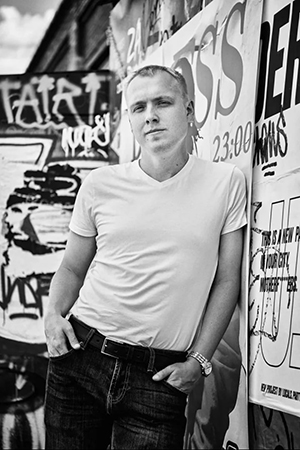

## rsschool-cv

# Valery Bolotin



## Junior Frontend Developer
***
## Contacts:
### Location: Belarus, Minsk
### tel:+375001234567
### email: bolotinval86@gmail.com
### Github: [Valery-Bolotin](https://github.com/Valery-Bolotin "Github") 
***
## About me:
> я слушаю как снежный ком растет и вечность бьет на каменных часах
## Soft skills:
* Обучаемость
* Стремление узнавать новое
* Работа в команде
***
## Tech Skills:
* HTML
* CSS
* Figma
* Git
### Tools:
* VS Code
* Sublime_text
***
## Code Example:
```
function fizzbuzz(n)
{
  let ar = [];
  for ( let i = 1; i <= n; i++) {
    if ( (i % 3 === 0) && (i % 5 === 0)) {
      ar.push('FizzBuzz');
    }
    else if ( i % 3 === 0 ) {
      ar.push("Fizz");
    }
    else if ( i % 5 === 0) {
      ar.push("Buzz");
    }
    else {
      ar.push(i);
    }
  }
  return ar;
}
```
***
## Experience:
### Github: [My CV](https://Valery-Bolotin.github.io/rsschool-cv/cv)
### Lectures on Youtube

***
## My Education:
### _Belarus State Economic University,_ __2008-2012__
***
## Languages:
### _Russian: Native_
### _English: Pre-Intermediate_
